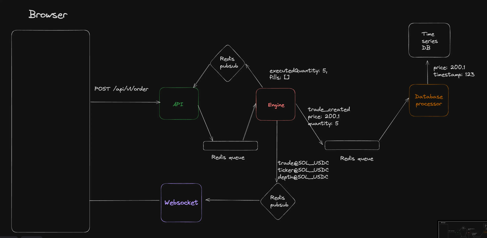

# Real-Time Trading Platform

A full-stack trading platform built as a microservices-based capstone project. It simulates the core workflow of a centralized exchange: authenticated users can deposit funds, place orders, see live order book and trade updates, and track wallet, portfolio, and order history from persisted backend state.

## What This Project Demonstrates

- A matching engine with price-time-priority order execution
- A microservices architecture with clear service boundaries
- Real-time market data fanout over WebSockets
- Persistent account, order, fill, and wallet ledger data in PostgreSQL/TimescaleDB
- A modern trading-style frontend built with Next.js
- End-to-end local orchestration with Docker Compose

This is not a production exchange. It is a strong engineering-focused simulation designed to showcase distributed backend design, real-time systems, and full-stack integration.

## Architecture

The system is split into six services:

- `frontend`: Next.js app for dashboard, wallet, portfolio, markets, and trade UI
- `api`: Express API gateway for authenticated user actions and read endpoints
- `engine`: in-memory matching engine and orderbook manager
- `ws`: WebSocket fanout service for ticker, depth, and trade streams
- `db-worker`: async persistence worker consuming engine events and writing to Postgres
- `mm`: simple market-maker bot to seed liquidity for demo purposes

Core data flow:

1. A user action hits the `api` service.
2. The API sends a message to the `engine` through Redis.
3. The engine matches or places the order in memory.
4. The engine emits:
   - direct response messages back to the API
   - market-data updates for WebSocket subscribers
   - persistence events for the DB worker
5. The `db-worker` writes orders, trade fills, wallet ledger entries, and balance changes to Postgres.
6. The frontend reads current state from the API and subscribes to live market streams through `ws`.



## Tech Stack

- Frontend: Next.js 16, React 19, TypeScript, Tailwind CSS, Radix UI, Lightweight Charts
- Backend: Node.js, Express, TypeScript
- Real-time: WebSockets, Redis Pub/Sub, Redis queues
- Database: PostgreSQL + TimescaleDB
- Auth: Clerk
- Infra: Docker, Docker Compose, pnpm workspaces
- Testing: Vitest

## Runtime Modes

This repo now supports two explicit startup modes:

- `pnpm dev`: local development mode. Only `redis` and `timescaledb` run in Docker. All Node services run on your host with file watching.
- `pnpm compose:backend:up`: production-style backend mode. Docker Compose runs the backend microservices on one host.

This matches the intended deployment split:

- `frontend`: deploy separately, for example on Vercel
- backend microservices (`api`, `ws`, `engine`, `db-worker`, `db-cron`, `mm`) plus infrastructure (`redis`, `timescaledb`): run on your VPS with Docker Compose

Docker Compose profiles are used to keep this standard and explicit:

- default services: infrastructure only
- `backend` profile: backend microservices
- `frontend` profile: optional containerized frontend for an all-in-one local demo

## Current Features

### Trading Engine

- Multiple market support
- Price-time-priority matching
- Partial fills
- Order cancellation
- In-memory orderbook restore from persisted open orders on startup
- Real-time ticker, trade, and depth event publishing

### Persistent Data Model

- Users
- Balances by asset
- Markets and assets
- Orders with open / partially filled / filled / cancelled states
- Trade fills
- Wallet ledger entries
- Deposits and withdrawals

### Frontend

- Markets page with live-backed market summaries
- Trade page with:
  - order entry
  - live orderbook depth
  - live ticker updates
  - chart data
  - user order history
- Wallet page with deposit/withdraw actions and transaction history
- Portfolio page with holdings and allocation
- Dashboard page with balance, PnL summary, and recent activity

## What Is Real vs Simulated

Real in this project:

- Order matching
- Balance locking/unlocking
- Open order persistence
- Trade persistence
- Portfolio/wallet/order history reads from DB
- Real-time market data streaming

Simulated or simplified:

- Deposits and withdrawals are manual/demo actions, not real banking rails
- The market maker is a demo bot, not a serious strategy
- The engine keeps the live orderbook in memory
- Risk checks and exchange-grade security controls are intentionally simplified

## Setup

### Prerequisites

- Docker
- Docker Compose
- Node.js 20+
- `pnpm` via `corepack enable`

### 1. Clone and Configure

```bash
git clone https://github.com/sheikh162/trading-platform.git
cd trading-platform
cp .env.example .env
cp services/api/.env.example services/api/.env
cp services/persistence/.env.example services/persistence/.env
cp services/engine/.env.example services/engine/.env
cp apps/frontend/.env.example apps/frontend/.env
cp services/market-maker/.env.example services/market-maker/.env
cp services/ws-gateway/.env.example services/ws-gateway/.env
```

Fill in your Clerk keys in the relevant `.env` files before running the full app.

### 2. Install Dependencies

```bash
pnpm install
```

## Local Development

Run Redis and TimescaleDB in Docker, and run the application services directly on your machine:

```bash
pnpm dev
```

What `pnpm dev` does:

- starts `redis` and `timescaledb` with Docker Compose
- waits for both infra services to become reachable
- applies DB migrations and seeds Timescale objects
- starts `engine`, `db`, `api`, `ws`, `mm`, and `frontend` on the host in watch mode

Local URLs:

- Frontend: `http://localhost:3002`
- API: `http://localhost:3000`
- WebSocket service: `ws://localhost:3001`

To stop the Dockerized infra only:

```bash
pnpm infra:down
```

If you need to re-apply the DB seed manually:

```bash
pnpm db:seed
```

## Production Backend with Docker Compose

For your VPS deployment, keep the frontend separate and start only the backend stack:

```bash
pnpm compose:backend:up
```

That command starts:

- `redis`
- `timescaledb`
- `engine`
- `db-seed`
- `db-worker`
- `db-cron`
- `api`
- `ws`
- `mm`

To stop the Compose stack:

```bash
pnpm compose:down
```

If you ever want a single-host demo with the frontend container included:

```bash
pnpm compose:full:up
```

## Useful Commands

```bash
pnpm -C db build
pnpm -C engine test --run
pnpm -C api build
pnpm -C frontend lint
pnpm -C frontend build
```

## Demo Flow

The best demo sequence is:

1. Sign up / sign in
2. Open `/wallet`
3. Deposit demo funds
4. Go to `/trade/BTC_USDT`
5. Place a buy or sell order
6. Watch live depth and ticker updates
7. Revisit:
   - `/wallet`
   - `/portfolio`
   - `/dashboard`
   - the trade page order panel

If the market is empty, start the market-maker service so the book has liquidity.

## Design Decisions

### Why separate `engine` and `db-worker`?

The engine is optimized for fast in-memory order handling. Persistence is handled asynchronously by a dedicated worker so order matching logic stays isolated from slower DB writes.

### Why Redis in the middle?

Redis is used for:

- request/response messaging between API and engine
- pub/sub for real-time market streams
- queue-based event delivery to the DB worker

This keeps service boundaries simple while still demonstrating asynchronous backend design.

### Why TimescaleDB?

Trade and candle data are time-series shaped. TimescaleDB is a good fit for storing fills/trades and generating chart-friendly data efficiently.

## Known Limitations

- The engine orderbook remains in memory during runtime
- Deposits and withdrawals are simulated
- No advanced risk engine, rate limiting, or admin tooling yet
- No production-grade observability stack
- Frontend deployment configuration for Vercel is still managed separately from the backend Compose stack
- Some service-level READMEs are still catching up to the latest architecture

## Resume Value

This project is intended to be a strong resume capstone because it combines:

- distributed systems thinking
- real-time data streaming
- backend state consistency problems
- matching engine logic
- full-stack product implementation
- Dockerized local deployment

## Future Improvements

Reasonable next steps for this project:

- request validation at API boundaries
- integration tests for deposit -> order -> fill -> cancel flows
- private real-time order status updates over WebSocket
- cleaner service-level docs
- lightweight admin/ops monitoring page

## Repository Structure

```text
apps/frontend/            Next.js client app
services/api/            Express API gateway
services/engine/         Matching engine and orderbook
services/persistence/    DB worker, migrations, seeding, materialized view refresh logic
services/market-maker/   Demo market-maker bot
services/ws-gateway/     WebSocket fanout service
packages/                Shared config, logger, and message contracts
infra/compose/           Base and production Compose manifests
```

## License

[MIT](LICENSE)
